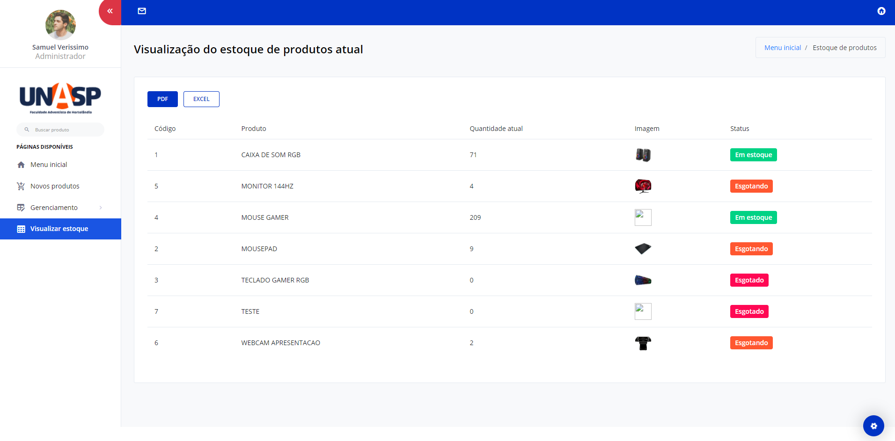

# Projeto de estoque 
Desenvolvi esse sistema com a finalidade de gerenciar um estoque. 

Foi referente há um projeto de minha faculdade, é um sistema, feito de uma maneira simples com PHP puro e MySQL, no entanto, bem funcional, dinâmico e simples!

# Tela inicial

### Funcionalidades 

- Cadastrar produtos             
- Gerenciamento de entradas/saídas dos produtos (Cadastros e relatórios)
- Visualização do seu estoque atual 
- Notificações referente aos produtos. Exemplo: (O produto: X foi esgotado!", "Por favor, adicione uma imagem ao produto: X")
- Logs do sistema

### Linguagens utilizadas 

- PHP   
- jQuery    (JavaScript)       
- Bootstrap (Framework) 
- MySQL     (Banco de dados)

Observações: estou deixando disponíveis apenas o Back-end e SQL desenvolvido.
